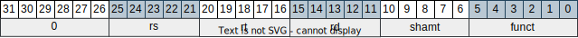

# No pipeline
In this MIPS structure, all instructions take the same number of clock cycles (monocycle processor) to be executed (here, 1-cicle). To make it possible, it is necessary to use a memory for instructions and another for data.

## Instructions
The following instructions will be available:
 - The memory-reference instructions load word (lw) and store word (sw);
 - The arithmetic-logical R-type (register reference) instructions add, sub, AND, OR and slt;
 - The arithmetic-logical I-type (immediate) addiu;
 - The instructions branch equal (beq) and jump (j).
Other integer instructions (shift, multiply, divide) and floating point instructions will not be included in this version.

### Instruction classes
- R-type instructions

The opcode field [31:26] is 0, rs and rt fields are source registers, and rd the destination one. The shamt field is used for shift operations (not available in this version), and the funct field defines the ALU function to be performed (add -> 6'b100000, sub -> 6'b100010, AND -> 6'b100100, OR -> 6'b100101 and slt(set on less than) -> 6'b101010).

- I-type instructions

The opcode field is 9 (6'b001001) for addiu. The rs register contains one of the sources values and the rt is the destination register. The other source value comes from the 16-bit immediate field, that is extended to a 32-bit word according to the operation. If the operation to be performed is addiu, it is used the sign extended value. Otherwise, it is used the zero extended value.

- Memory-reference instructions

The opcode field [31:26] is 35 (6'b100011) for load and 43 (6'b101011) for store operations. The rs field indicates the register that contains the value to be added to the address field one to obtain the memory address. For load operations, register rt stores the value received from memory at the calculated address (rt <= mem[rs + address]). For store operations, register rt contais the value to be stored in memory at the calculated address (rt => mem[rs + address]).    

- Branch instruction

The opcode field [31:26] is 4 (6'b000100) for branch equal (beq). The registers rs and rt as sources for the comparison operation. The address field value is extended, shifted left by 2 and added to the next PC value (PC + 4 + address) to obtain the branch target address.

- Jump instruction

The opcode field [31:26] is 2 (6'b000010) for jump (j). The jump target address is composed by the 4 most significant bits of current PC + 4 (next instruction address) concatenated with the 26-bit address field. The 2 least significant bits remaining receive 00. 
next_PC <= {PC_plus_4[31:28], address, 2'b00}

## Structure

