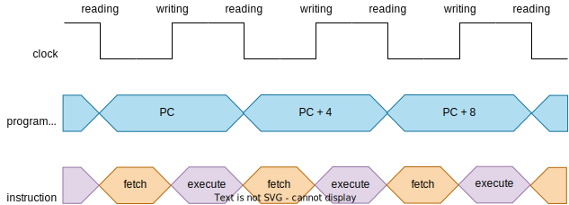

# mips_np

## Instruction Cycle

  

On the falling edge, the PC value, the register file and the memories outputs are updated. The control signals are set accordig to the read instruction (reading/fetch). On the rising edge, the result is written to the register file or the data memory, depending on the instruction (writing/execute).  

## Connections

  

This MIPS description has the following conncections:
- **clock_in:** main clock signal;
- **reset_in:** it resets PC to 0;
- **instr_clock_in:** clock signal for instructions writing;
- **instr_write_in:** it enables the instruction writing;
- **instr_address_in:** instruction address;
- **instr_in:** instruction to be written;
- **read_instr_out:** value in imem[instr_address_in];
- **read_data_address_in:** data address;
- **read_data_out:** value in dmem[read_data_address_in].  

