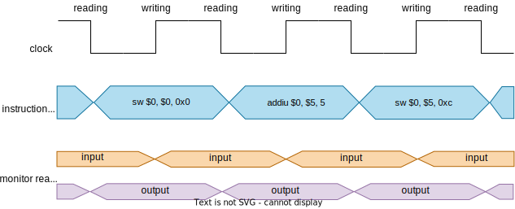

# Testbench

This oriented object testbench inserts instructions in the MIPS description and checks automatically if the MIPS output is correct.  
The following figure contains the testbench structure with its main components.

## Testbench Structure

Here:
 - **mips_np** is the device under test (DUT);
 - **interface** connects the DUT to the testbench environment (**env**);
 - **driver** sends stimulus provided by the **test** to the **interface** to be inserted in the **mips_np** and obtains its output signals;
 - **test** contains the stimulus to be verified. It can use the output signals from the **mips_np** to change the stimulus sequence;
 - **input_monitor** and **output_monitor** read the input and the output signals respectively and send that values to the **scoreboard**;
 - **scoreboard** receives the input signals, defines the expected output signals, compares them to the **mips_np** output signals and shows if that values are correct or not.

## Testbench cycle

In this testbench, the instructions are inserted on the falling clock egde. The input monitor reads the input values on the rising clock edge, when the input signals don't change, and the output monitor reads the outputs values on the falling clock edge, when the output signals don't change.  
During the instruction writing (instrWrite_in = 1), all instructions are written in a data structure of the scoreboard. When instrWrite_in is equal to 0, the scoreboard executes the received instructions and determines the output values.  
while instrWrite_in is equal to 0, the output checking will occur when the check code (opcode = 6'b111111) is detected.  

**OBS.:** *The testbench results can be seen in the testbench_output.txt file.*