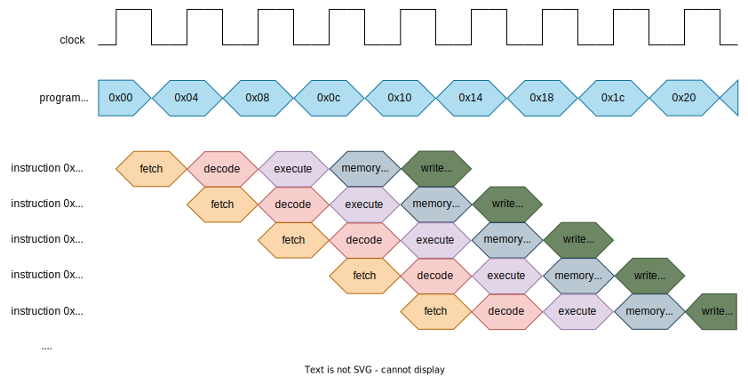
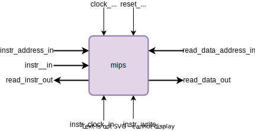

# mips

## Instruction Cycle

 

In this structure, a instruction cycle takes 5 clock cycles to be done. The program counter value is updated on the falling edge and the instruction stage is changed on the rising edge.  
As said earlier, in:  
 - Instruction Fetch (**IF**): The instruction pointed to by the PC value is read from instruction memory and the PC is updated;  
 - Instruction Decode (**ID**); The instruction is decoded, the control signals for its execution are generated and the requested data is read from the register file. Furthermore, if it is the **beq** or **j** instruction, its execution is done at this stage as well;  
 - Execution or address calculation (**EX**): According to the values generated in the **ID** stage, the instruction is executed or the data memory address is obtained;
 - Data Memory access (**MEM**): If it is a memory access instruction (**lw** or **sw**), the data memory is accessed for reading or writing;
 - Write Back (**WB**): The execution result is stored in the register file according to the instruction.

 **OBS.:** *The memory read clock input signal must be delayed (1/4 cycle in this description) to prevent instruction reading from occurring at the same time as the PC update and fetching the wrong one.*

## Connections

  

This MIPS description has the following connections:
- **clock_in:** main clock signal;
- **reset_in:** it resets PC and stage registers to 0;
- **instr_clock_in:** clock signal for instructions writing;
- **instr_write_in:** it enables the instruction writing;
- **instr_address_in:** instruction address;
- **instr_in:** instruction to be written;
- **read_instr_out:** value in imem[instr_address_in];
- **read_data_address_in:** data address;
- **read_data_out:** value in dmem[read_data_address_in].