# Forwarding Unit (fwu)

This component deals with some data hazards that can occur between pipeline stages when the instruction to be executed needs a data (from some register) that is not updated because the previous intruction, that will update it, don't complete write back stage. So, it is necessary to forward the updated data from the write back or memory access or execute stage. A similar idea is used to forward values to the decode stage in the **beq** instruction.

## Example

 

Here, the value of the register **$5** is required in various instructions. When the execution stage of the first instruction (addiu $0, **$5**, 3), there are two values for **$5**: The value stored in the register file (87) and the updated one generated in the execution stage (**upd_$5** = 3).  
When the following instruction (or $4, **$5**, $7) reaches to the execution stage, the value that must be used is the updated one. So, the **upd_$5** has to be forwarded to current execution stage as rt value.  
Something similar happens in the next execution. Now, the instruction and $3, **$5**, $10 requires the value of **$5**. Again, the **upd_$5** has to be forwarded to current execution stage as rt value.  
After the write back conclusion of the first instruction (addiu $0, **$5**, 3), it is not necessary to forward the **upd_$5** because this value has already been written in the register file.   
Multiplexers are used to forward data.  

## Forwarding Conditions
**id_muxA**
condition | result
----------|--------
(id_branch == 1'b1) && (ex_regWrite == 1'b1) && (ex_rd != 5'd0) && (id_rs == ex_rd) | ix_muxA <= 2'b01
(id_branch == 1'b1) && (mem_regWrite == 1'b1) && (mem_rd != 5'd0) && (id_rs == mem_rd) | id_muxA <= 2'b10
(id_branch == 1'b1) && (wb_regWrite == 1'b1) && (wb_rd != 5'd0) && (id_rs == wb_rd) | id_muxA <= 2'b11
ohters                                                          | id_muxA <= 2'b00

**id_muxB**
condition | result
----------|--------
(id_branch == 1'b1) && (ex_regWrite == 1'b1) && (ex_rd != 5'd0) && (id_rt == ex_rd) | ix_muxB <= 2'b01
(id_branch == 1'b1) && (mem_regWrite == 1'b1) && (mem_rd != 5'd0) && (id_rt == mem_rd) | id_muxB <= 2'b10
(id_branch == 1'b1) && (wb_regWrite == 1'b1) && (wb_rd != 5'd0) && (id_rt == wb_rd) | id_muxB <= 2'b11
ohters                                                          | id_muxB <= 2'b00

**ex_muxA**
condition | result
----------|--------
(mem_regWrite == 1'b1) && (mem_rd != 5'd0) && (ex_rs == mem_rd) | ex_muxA <= 2'b01
(wb_regWrite == 1'b1) && (wb_rd != 5'd0) && (ex_rs == wb_rd)    | ex_muxA <= 2'b10
ohters                                                          | ex_muxA <= 2'b00

**ex_muxB**
condition | result
----------|--------
(mem_regWrite == 1'b1) && (mem_rd != 5'd0) && (ex_rt == mem_rd) | ex_muxB <= 2'b01
(wb_regWrite == 1'b1) && (wb_rd != 5'd0) && (ex_rt == wb_rd)    | ex_muxB <= 2'b10
ohters                                                          | ex_muxB <= 2'b00