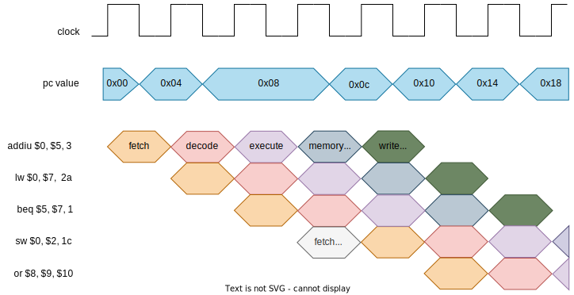

# Hazard Detection Unit (hdu)

This component detects hazards involving branch instructions and data memory loadings (beq instruction needs a data that has not yet been loaded from data memory) and prevents the PC and IF_ID update by 1 clock cycle.  

## Example

 

The second instruction (lw $0, **$7**,  2a) loads a data from the memory and stores in a register of the register file. The third instruction (beq $5, **$7**, 1) is a branch instruction and needs the data of the previous load instruction but the instruction didn't reach the memory access stage to perform the load operarion. So, to deal with this situation, the PC value is not updated and the fetch of the next instruction is delayed by 1 clock cycle. In this period, the load operation is performed and the updated data is followed to the branch decode/execution stage. After that, the PC update and the instruction fetch are normalized. 

## Stalling Condition

condition | result
----------|--------
(opcode == 5'd4) && (id_ex_memRead) (id_ex_rd != 5'd0) && ((rs == id_ex_rd) \|\| (rt == id_ex_rd)) | pc_wr_out <= 1'b0 
\|\| |  if_id_wr_out <= 1'b0 
\|\| |  flush_control_out <= 1'b1
others    | pc_wr_out <= 1'b1
\|\| |  if_id_wr_out <= 1'b1
\|\| |  flush_control_out <= 1'b0

